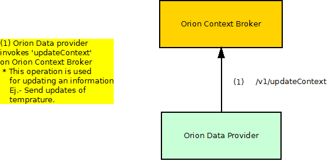
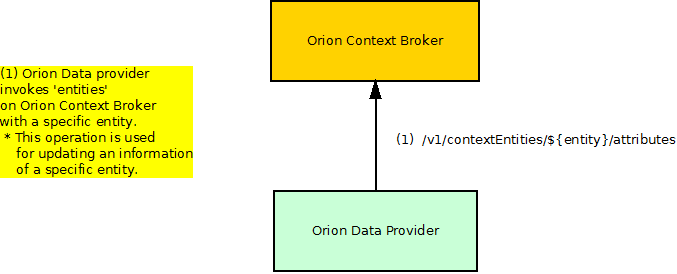
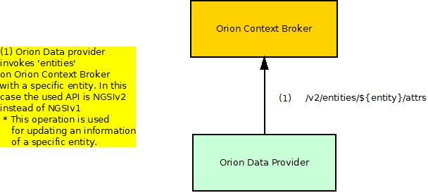
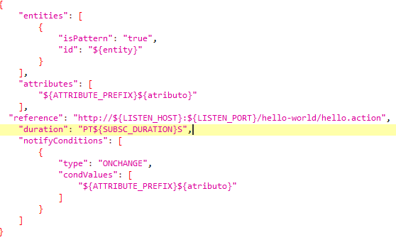

# Orion Context Broker: test cases description #

The scenarios defined for stress testing are taken from the most used operations of Orion Context Broker GEri which correspond to the following API methods:

- `Update`
- `Convenience Update` 
- `NGSlv2 Update`.

## Test Cases 1,2.- Update context performance ##

In this scenario, Orion is stressed with massive update requests. No subscription exists in the database, so no notifications are generated during the test. The update request contains a random number of attribute updates. There are two test related with this one. The first of them sends between 1 and 6 attributes while the second one sends between 1 and 6 of them. 

In the involved dataflow, as depicted by the picture above, are expected 2 main actors which are played respectively by the hosts shown in the following table:

| Actor | SW Involved | VM Host | Role |
|-------|:------------|:--------|:-----|
| Orion Data provider | JMeter + Beanshell module | Tester machine | Injects load to the component |
| Orion Context Broker | Orion | Hosting machine 1 | Subject of the test |

The update request contains a random number of attribute updates. This number is between 1 and 20 (or between 1 and 6). There is a point where there are 300 concurrent threads.

|ID	| GE API method	| Operation	| Type	| Payload	| Max. Concurrent Threads |
|---|:--------------|:----------|:------|:----------|:------------------------|
| 1 |	/v1/updateContext |	Update	| POST	| ${randomAttributesUpdateRequest} (generated by Beanshell) |300 |

The value of the variable "randomAttributesUpdateRequest" is generated by beanshell code.

## Test Case 3.- Convenience Update Stress ##

This case is analogous to Test case 1, but updating attributes for a specific entity in each request.

The actors involved in this case are the same ones than in the last scenario.

In this case a specific entity is send in the request. The entity is just an ID of this type: '00000' with a random number. The number of threads created is 300 like in the last case.

|ID	| GE API method	| Operation	| Type	| Payload	| Max. Concurrent Threads |
|---|:--------------|:----------|:------|:----------|:------------------------|
| 1 |	/v1/contextEntities/\${entity}/attributes |	Convenience Update	| POST	| ${randomAttributesUpdateRequest} (generated by Beanshell) |300 |

The value of the variable "randomAttributesUpdateRequest" is generated by beanshell code.

## Test Case 4.- NGSIv2 Update Stress ##

This test case is analogous to Test case 3, but this time using the NGSIv2 API instead NGSIv1.

The actors involved in this case are the same ones than in the last scenario.

In this case a specific entity is send in the request. The entity is just an ID of this type: '00000' with a random number. The number of threads created is 300 like in the last case.

|ID	| GE API method	| Operation	| Type	| Payload	| Max. Concurrent Threads |
|---|:--------------|:----------|:------|:----------|:------------------------|
| 1 |	/v2/entities/\${entity}/attrs |	Update NGSIv2 | POST	| ${randomAttributesUpdateRequest} (generated by Beanshell) |300 |

The value of the variable "randomAttributesUpdateRequest" is generated by beanshell code.

## Test Case 5.- Update Stress (With notifications) ##

This case is analogous to Test case 1, but launching first a load of 1000 subscriptions in order to maker Orion generate notifications. So there arte two parts differentiated on this test.
First we launch 1000 subscriptions.

The actors involved in this case are the same ones than in the last scenario.

The subscription consist on a request whose body is some JSON.

|ID	| GE API method	| Operation	| Type	| Payload	| Max. Concurrent Threads |
|---|:--------------|:----------|:------|:----------|:------------------------|
| 1 |	/v1/subscribeContext |	Subscription | POST	|  |300 |

After doing the subscriptions we should launch another script that is the same one than in the first test case. The only difference is that some notifications are generated.

## Test Case 6.- NGSIv2 update Stress with notifications ##

Like in test case 5 we launch 1000 notifications but then , instead of launching the script related with the first test case, we use the one related to the fourth one.

## Test Case 7.- Combined Stability Scenario ##

This test case consist on mixing update, convenience update and subscription requests with a moderate load during a long time, in order to determine if some system degradation occurs along the time.

The actors involved in this case are the same than in the rest of test cases. 

As we have said before the objetive is to determine if some system degradation occurs along the time, so we launch diverse type of requests during 6 hours.

|ID	| GE API method	| Operation	| Type	| Payload	| Max. Concurrent Threads |
|---|:--------------|:----------|:------|:----------|:------------------------|
| 1 |	/v1/subscribeContext |	Subscription | POST	|  | 10 |
| 4 |	/v1/updateContext |	Update	| POST	| ${randomAttributesUpdateRequest} (generated by Beanshell) | 10 |
| 3 |	/v1/contextEntities/\${entity}/attributes |	Convenience Update	| POST	| ${randomAttributesUpdateRequest} (generated by Beanshell) | 10 |

The value of the attributes and entities used during the test is generated randomly.

## Test Case 8.- Optimized Combined Stability Scenario ##

It's analogous to the test case 7 but with some optimizations recommended by Orion’s developer

- Added the next parameters to Orion startup
  -  \-reqMutexPolicy none -writeConcern 0 -logLevel ERROR -notificationMode threadpool:q:n

- Created four indexes over the entities collection in the database:
  - db.entities.createIndex( { "_id.id": 1 } )
  - db.entities.createIndex( { "_id.type": 1 } )
  - db.entities.createIndex( { "_id.servicePath": 1 } )
  - db.entities.createIndex( { "attrNames": 1 } )

## Test Case 9.- No Cache Optimized Combined Stability Scenario ##

This scenario is the same that the test case 8, but the cache is disabled at Orion’s startup 
